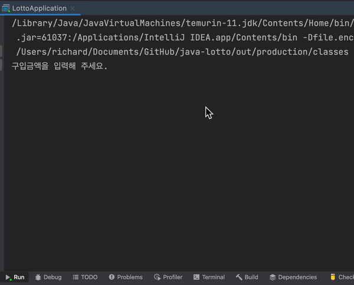

    

# 로또 - OOP

---

> 우아한테크코스 웹 백엔드 4기, 로또 - OOP 저장소입니다.

  

## 기능 구현 목록

---

### 도메인

#### Wallet : 잔액, 수동 로또 구매 수량, 자동 로또 구매 수량을 보관하는 VO

- [x] 1000원 이상, 1000원 단위로만 생성 가능
- [x] 수동 구매 수량 전달 시 잔액 차감 처리 및 수동 구매 수량 주입
- [x] 잔액 전액으로 자동 로또 구매 처리

#### Lotto : 길이가 6인 `List<LottoNumber>` 를 가진 일급 컬렉션

- [x] 다른 Lotto 와 비교하여 일치하는 LottoNumber 의 개수를 반환한다.
- [x] 유효성 검사
    - [x] 생성자에 전달된 List<Lotto> 의 길이가 6인지 검사
    - [x] 생성자에서 전달받은 List 에 중복되는 LottoNumber 가 포함되어있는지 검사

#### Lottos : 길이가 1 이상인 `List<Lotto>` 를 가진 일급 컬렉션

- [x] 또다른 Lottos를 전달 받아 하나의 Lottos를 반환하는 기능 추가
- [x] 유효성 검사
    - [x] 비어있는 Lotto 가 전달 되었는지 검사

#### WinningLotto : 당첨 번호, 보너스 번호를 각각 `Lotto`, `LottoNumber` 로 가지고 있는 객체

- [x] 유효성 검사
    - [x] BonusNumber 가 Lotto 에 포함되어 있는지 검사

#### LottoFactory : 자동 로또 생성 역할

- [x] 전달된 수량 만큼 자동로또를 생성해 Lottos에 담아 반환
- [x] 유효성 검사
    - [x] 요청 수량이 1 미만일 경우 IAE 발생

#### LottoNumberRepository : LottoNumber 캐싱 저장소

- [x] 로또 번호를 요청 받아, 요청에 따른 LottoNumber 캐싱값을 반환
- [x] 유효성 검사는 LottoNumber 생성자에 위임

#### LottoResultHandler : 당첨 결과 집계 및 DTO로 반환

- [x] WinningLotto, Lottos를 전달 받아, LottoResultDto를 반환
- [x] 수익률, 등수별 당첨 횟수를 집계하여 반환

 

### 입력

#### InputView : 구입금액, 당첨번호를 입력 받는 View

- [x] 로또 구입 금액을 입력한다.
    - [x] (입력값 검증) 정수가 아닌 문자열을 입력 받을 수 없다.
    - [x] (입력값 검증) 0이하의 숫자를 입력 받을 수 없다.
    - [x] (입력값 검증, 선택) 1000으로 나누어 떨어지지 않는 금액은 입력받을 수 없다.
- [x] 수동 로또 구매 수량을 입력한다.
- [x] 수동 로또 구매 수량 만큼 로또 번호를 입력한다.
- [x] 수동 로또를 생성한다.
- [x] 수동 로또를 사고 잔액은 모두 자동 로또를 구매, 생성한다.
    - [x] 로또 생성 개수는 잔액 / 1000
    - [x] 랜덤 번호 6개를 생성한다
        - [x] 번호의 범위는 `1 ~ 45`
- [x] 생성된 로또 개수와 각 로또들을 출력한다.
- [x] 당첨 번호를 입력한다.
    - [x] 일반 당첨 번호를 입력한다.
        - [x] 각 번호는 `, ` 로 구분한다 (ex `1, 2, 3, 4, 5, 6`)
        - [x] (입력값 검증) 입력 숫자의 개수는 6개여야 한다.
        - [x] (입력값 검증) 정수가 아닌 문자열을 입력 받을 수 없다.
        - [x] (입력 값 검증) 0이하 46이상의 숫자를 입력 받을 수 없다.
        - [x] (입력값 검증) 중복된 숫자가 없어야한다.
    - [x] 보너스 볼 번호를 입력한다.
        - [x] (입력값 검증) 정수가 아닌 문자열을 입력 받을 수 없다.
        - [x] (입력값 검증) 0이하 46이상의 숫자를 입력 받을 수 없다.
        - [x] (입력값 검증) 일반 당첨 번호에 존재하는 번호는 입력받을 수 없다.

 

### 출력

#### ResultView : `LottoResultDto` 를 전달받아 당첨 결과를 출력하는 View

- [x] 총 수익률을 (`당첨금액/로또구입금액`) 계산한다.
- [x] 당첨 통계를 출력한다.

  
