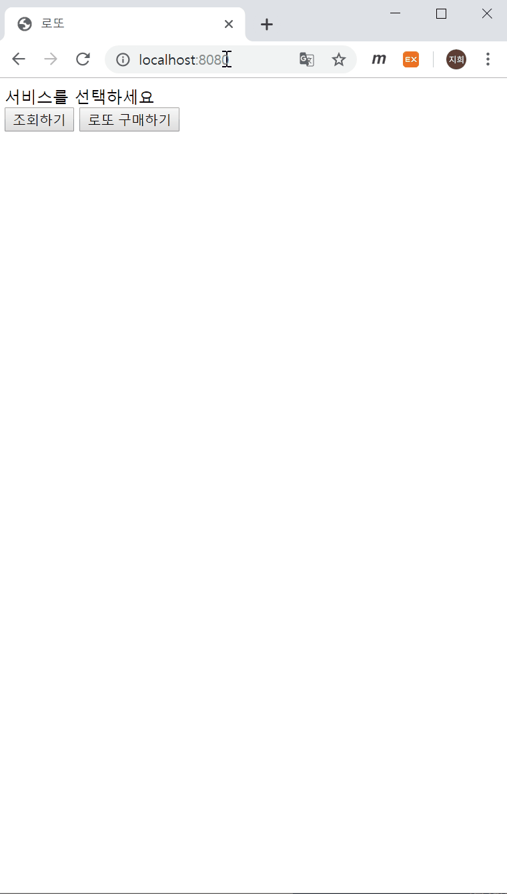
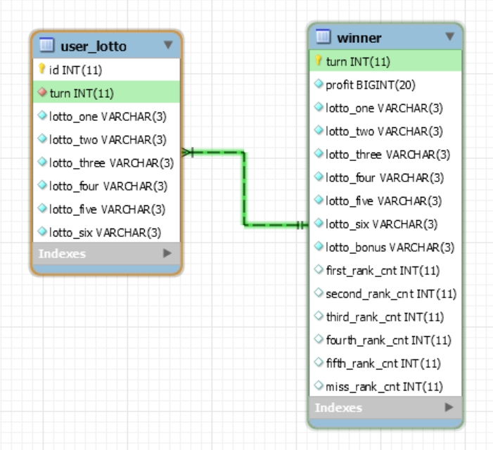

# 로또

web 데모 영상

EER Diagram

schema는 /schema 폴더 안에 정리

# 요구 사항 정리

- 구매 금액 설정
  - 정수만 가능
  - 1000원 이상 가능
- 수동 구매액 설정
  - 정수만 가능
  - 수동구매액 * 1000이 구입금액액보다 작아야 함
- 수동 몇장, 자동 몇장인지 확인
  - 수동개수 : 수동금액액
  - 자동개수 : (구매금액-수동구매액*1000)/1000
- 수동구매액만큼 수동 로또 생성
  - 수동개수만큼 로또들 생성
- 자동 로또 생성
  - 자동개수만큼 로또들 생성
- 자동 로또 출력

- 당첨번호 설정
  - 당첨번호 로또 생성
- 보너스볼 설정
  - 숫자만 가능
  - 당첨번호 로또와 숫자가 달라야함
- 당첨 통계 - 몇개 맞았는지 확인
  - 당첨
- 당첨 통계 출력
- 수익률 확인
- 수익률 출력
