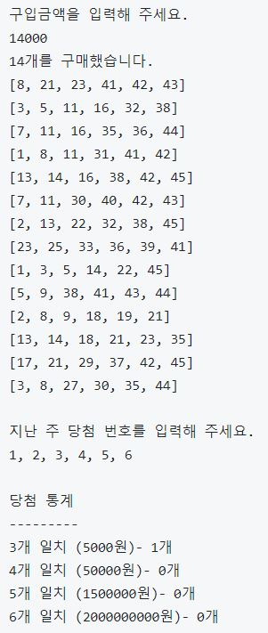

# java-lotto
로또 미션 진행을 위한 저장소

---

# 로또
- 로또는 1부터 45까지의 숫자 중 6개의 숫자를 임의로 선택하여 당첨번호와 
선택한 번호가 일치하는 개수에 따라 등위를 결정하게 되는 복권 게임이다.

### 당첨 선정 방식
- 1등 : 6개를 다 맞았을 경우
- 2등 : 5개와 보너스번호를 맞았을 경우
- 3등 : 5개를 맞았을 경우
- 4등 : 4개를 맞았을 경우
- 5등 : 3개를 맞았을 경우

---

# 로또 - 1단계

### 기능 요구사항
- 로또 구입 금액을 입력하면 구입 금액에 해당하는 로또를 발급해야 한다.
- 로또 1장의 가격은 1000원이다.

### 실행 결과

### 구현 기능
1. 로또 구매
    - 구입 금액 입력
        - [예외 처리] 입력이 없을 경우
        - [예외 처리] 숫자가 아닐 경우
        - [예외 처리] 구입 금액이 음수인 경우
        - [예외 처리] 구입 금액이 판매 단위가 아닌 경우(로또 1장 : 1,000원)
        - 금액에 따른 구입할 로또 수량 계산
        
    - 지난 주 당첨 번호 입력
        - [예외 처리] 입력이 없을 경우
        - [예외 처리] 입력한 번호 중 정수가 아닌 번호가 존재할 경우
        - [예외 처리] 입력한 번호 중 유효한 범위를 벗어난 번호가 존재할 경우
        - [예외 처리] 입력한 번호의 개수가 6개가 아닌 경우
        - [예외 처리] 번호를 중복해서 입력할 경우
        - 쉼표(,)를 기준으로 구분
        
2. 로또 생성
    - 구매자 로또 생성
        - [예외 처리] 동일하게 생성된 로또 검사(중복 검사)
        
    - 생성된 로또 발급
        - 오름차순으로 정렬된 상태로 출력

    - 당첨 로또 생성

3. 당첨 결과
    - 당첨 확인
        - 구매자 로또와 당첨 로또의 일치하는 번호 개수에 따른 등수 결정
    
    - 당첨 통계
        - 일치 개수와 해당 등수의 당첨금, 당첨된 로또의 수량을 출력
        - 총 수익률 = (총 당첨 금액) / (구입 금액)