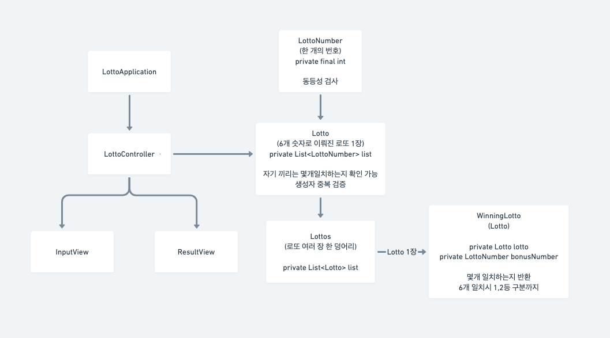

# 로또 미션 저장소

---

## 클래스 다이어그램

페어와 본격적인 프로그래밍 시작 전 위와 같이 설계를 먼저 진행하였습니다.

## 기능 구현 목록

- [X] 로또 구입 금액을 입력한다.
    - [X] (입력값 검증) 정수가 아닌 문자열을 입력 받을 수 없다.
    - [X] (입력값 검증) 0이하의 숫자를 입력 받을 수 없다.
    - [X] (입력값 검증, 선택) 1000으로 나누어 떨어지지 않는 금액은 입력받을 수 없다.
- [X] 로또를 생성한다.
    - [X] 로또 생성 개수는 구입금액 /1000
    - [X] 랜덤 번호 6개를 생성한다
        - [X] 번호의 범위는 `1 ~ 45`
- [X] 생성된 로또 개수와 각 로또들을 출력한다.
- [X] 당첨 번호를 입력한다.
    - [X] 일반 당첨 번호를 입력한다.
        - [X] 각 번호는 `, ` 로 구분한다 (ex `1, 2, 3, 4, 5, 6`)
        - [X] (입력값 검증) 입력 숫자의 개수는 6개여야 한다.
        - [X] (입력값 검증) 정수가 아닌 문자열을 입력 받을 수 없다.
        - [X] (입력 값 검증) 0이하 46이상의 숫자를 입력 받을 수 없다.
        - [X] (입력값 검증) 중복된 숫자가 없어야한다.
    - [X] 보너스 볼 번호를 입력한다.
        - [X] (입력값 검증) 정수가 아닌 문자열을 입력 받을 수 없다.
        - [X] (입력값 검증) 0이하 46이상의 숫자를 입력 받을 수 없다.
        - [X] (입력값 검증) 일반 당첨 번호에 존재하는 번호는 입력받을 수 없다.
- [X] 도메인
    - [X] LottoNumber
        - [X] 유효성 검사 - 1 ~ 45 사이의 정수값으로 생성
        - [X] 동등성 검사를 위한 equals & hashCode 재정의
    - [X] Lotto
        - [X] 유효성 검사
            - [X] 생성자에 전달된 List<Lotto> 의 길이가 6인지 검사
            - [X] 생성자에서 전달받은 List 에 중복되는 LottoNumber 가 포함되어있는지 검사
        - [X] 다른 Lotto 와 비교하여 일치하는 LottoNumber 의 개수를 반환한다.
    - [X] Lottos
        - [X] 유효성 검사
            - [X] 비어있는 Lotto 가 전달 되었는지 검사
        - [X] WinningLotto 를 전달 받아, 당첨 결과를 반환
    - [X] WinningLotto
        - [X] 유효성 검사
            - [X] BonusNumber 가 Lotto 에 포함되어 있는지 검사
    - [X] InputMoney
        - [X] 유효성 검사
            - [X] 1000 미만 입력 시 IAE 발생
            - [X] 1000으로 나누어 떨어지지 않는 금액 입력 시 IAE 발생
    - [X] RandomLottoNumberGenerateStrategy
        - [X] 랜덤 번호 7개 생성
    - [X] LottoQuantity
        - [X] 유효성 검사
            - [X] 양수가 아닌 값을 전달 받았을 경우 IAE 발생
- [X] 총 수익률을 (`당첨금액/로또구입금액`) 계산한다.
- [X] 당첨 통계를 출력한다.

## 리팩토링 To Do List

- [X] `TrialNumber` 를 `LottoQuantity` 로 변경
- [X] 누락된 `WinningCount` 에 대한 테스트 추가
- [X] ResultView 리팩토링
    - [X] `printResult` 메소드 리팩토링
        - [X] 출력문 깔끔하게 개선
        - [X] 5000원, 50000원 등의 상금도 Rank 에서 받아오도록 개선
        - [X] 수익률에 따른 손해, 이익 워딩 변경 필요
- [X] `InputMoney` 리팩토링
  - [X] 최소 금액 검증, 나누어 떨어짐 검증을 별개의 메소드로 분리
  - [X] 최소 금액, 나누어 떨어짐에 대한 테스트를 명확하게 개선
- [ ] `LottoResultDto` 리팩토링
  - [X] `getProfitRatio` 메소드 리팩토링
  - [ ] `from` 메소드 리팩토링
- [ ] `Lottos` 리팩토링
  - [ ] `setupMap` 메소드 리팩토링
  - [ ] `validateNullOrEmpty` 의 에러 메세지 상수화
- [X] `LottoNumbers` 리팩토링
  - [X] 매직넘버 (1, 45) 상수화
  - [X] `IntStream` 의 `rangeClosed` 메소드를 사용하여 개선
- [X] `LottoQuantity` 의 '횟수' 워딩 수정
- [ ] `WinningLotto` 리팩토링
  - [ ] `getRankByLotto` 메소드의 조건식 개선
  - [ ] `getRankByLotto` 의 매직넘버 5를 상수화
- [ ] `WinningCount` 리팩토링
  - [ ] `getCount` 의 메소드 선언 위치를 아래로 옮겨야 함
- [ ] `LottoController` 리팩토링
  - [ ] `generateLotto` 의 메소드가 10줄이 넘어감
- [X] `LottoNumber` 리팩토링
  - [X] 에러메세지에 포함된 숫자를 하드코딩하지 않도록 개선
- [ ] 테스트코드에서 불필요한 `hasMessageMatching` 을 `hasMessage` 로 변경
- [ ] Exception 메세지 마침표 통일
- [ ] 테스트코드를 Describe-Context-It 패턴을 적용해 개선 (@Nested)
- [ ] `LottoResultDto` 에 대한 테스트 코드 추가
- [ ] 모든 클래스의 메소드 선언 순서를 검토할 필요 있음
  - [ ] 글 처럼 읽히는 순서인지 확인할 필요 있음
- [ ] 큰 숫자에 Underscore (`_`) 사용하여 가독성 증진
- [ ] 보너스 볼 공백 입력 시 `[ERROR] For input string: ""` 가 출력됨

## 고민들

- DTO 가 계산 로직을 가져도 될까?
- `InputMoney` 에 `getMoney` 를 사용하여 로또 개수를 계산하는 대신, `InputMoney` 에서 직접 로또 개수를 계산해주는 로직을 처리하면 단일책임 위배인가?
- `WinningLotto` 가 `Rank` 에 대해 알고 있는 것이 좋은 구조일까?
- `LottoNumberGenerateStrategy` 는 추후 테스트더블을 만들어 테스트하기 편한 구조로 만들기 위해 생성한 인터페이스인데, 의도에 맞게 사용되고 있는가?
  - 실제 이를 사용하여 테스트를 진행하지 않고 있음.
- 테스트 픽스쳐를 위한 객체를 깔끔하게 생성하는방법은 무엇일까?
  > 예시: `LottoTest` 의 `setupLottos` 메소드
- 에러 메세지까지 상수로 분리해야할까?
- 로또 숫자 리스트를 담기위해 `LottoNumbers` 라는 클래스 형태로 상수로 분리하는것이 맞을까?
- 성능을 고려해 원시 for 문을 사용하는 것이 맞을까?
  - 원시 for 보다 가독성이 보장되는 경우 성능을 조금 포기하고 stream 을 사용하는것이 좋지 않을까?
- 테스트코드의 번수 네이밍을 `actual`, `expected` 를 사용하여 개선하는게 좋지 않을까?
- 애플리케이션 전반에서 사용되는 `1` 과 `45` 는 별도의 상수로 분리하는 것이 좋지 않을까?