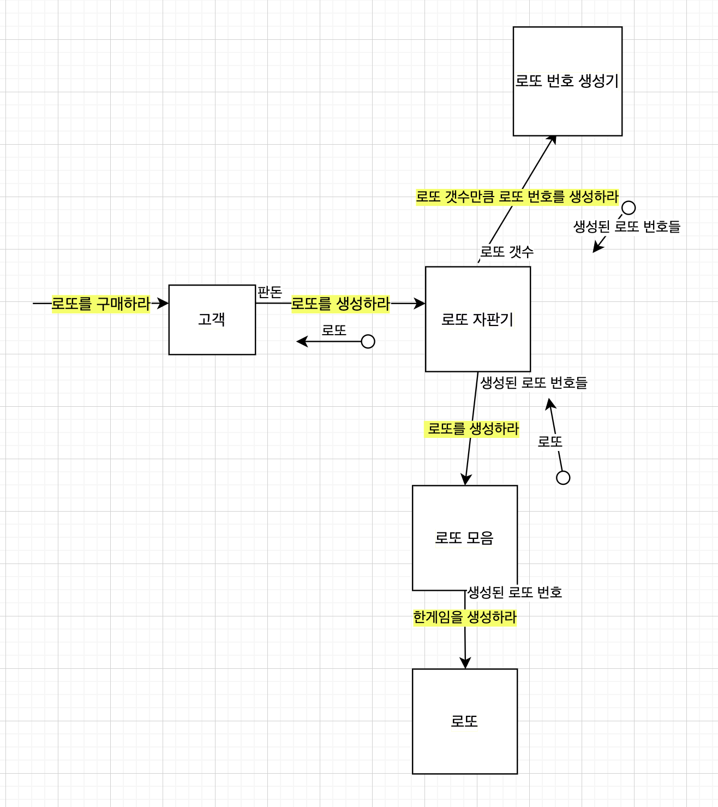

## 객체 협력 정리

## 매세지 정의 
- 로또 금액을 반환하
- 로또를 구매하라 
- 로또를 생성하라
- 로또 갯수만큼 로또 번호를 생성하라 
- 로또 번호를 생성하라
- 한 게임을 생성하라 
- 구입금액을 입력하라 
- 당첨 번호를 입력하라
- 보너스 볼을 입력하라 
- 로또 갯수를 구하라 
- 생성된 로또번호를 출력하라
- 당첨 갯수를 구하라  
- 수익률을 계산하라 

## 기능 요구사항 정리 
- [x] 구현 부분 구입금액 입력 확인 
- [x] 보장된 구입금액을 입력 받는다.
    - 보장된 구입금액(로또 티켓 구입 금액보다 큰 양수의 숫자)
    - [x] 보장된 구입금액이 아니면 에러가 발생한다. 
        - `IllegalArgumentException`
- [x] 구입금액 따른 로또의 갯수를 구한다.
- [x] 보장된 로또 번호로 한 로또를 생성한다.
    - 보장된 로또 번호(중복되지 않은 1~45의 숫자이며, 6개의 숫자)
- [x] 로또 갯수만큼 보장된 로또번호를 출력한다. 
    - 보장된 로또번호(중복되지 않은 1~45의 숫자이며, 6개의 숫자)
- [x] 콘솔 창에 당첨번호를 입력한다.   
- [x] 보장된 당첨 번호를 입력한다.
    - 보장된 당첨 번호(중복되지 않은 1~45의 숫자, 6개의 숫자)
    - [x] 보장된 당첨 번호가 아니면 에러가 발생한다. 
        - `IllegalArgumentException`
- [x] 보장된 보너스 볼을 입력 받는다. 
    - 보장된 보너스 볼(보장된 당첨 번호와 중복되지 않는 1~45의 숫자)
    - [x] 보장된 보너스 볼이 아니면 에러가 발생한다.
        - `IllegalArgumentException`
- [x] 보너스 볼 포함 당첨 현황을 구한다.   
- [x] 당첨 통계를 출력한다. 
- [x] 수익률을 출력한다.

## 리펙토링 목록 정리
### step1 1차 피드백
- [x] DTO 제거기(DTO 없이 view에 값을 전달 할 수 있다.)
- [x] 책임에 대해 한번더 생각하기
- [x] BonusBall 제거
- [x] LottoGameMachine 책임 분리하기
    - [x] 입력 파싱 책임 제거
    - [x] gnerate 제거
    - [x] of 제거
- [x] 테스트메서드 한글 이름 영어로 변경 (의도를 더 드러내자)
- [x] 사용되지 않는 값 제거
- [x] 사용되지 않은 메서드 제거
- [x] 제네릭 빠진 것 확인
- [x] DisplayName 의도를 더 정확히 드러내

### step1 2차 피드백
- [x] GameManageApplication 메서드 순서 변경 - d534d61
- [x] InputUtils 책임 재정의 - 562e9c7
- [x] RandomLottoBall 생성 책임 변경하기 - ddb0c9b
- [x] LottoGameMachine 네이밍 변경
- [x] 출력 메시지 동일하게 수정 - cc77469
- [x] HashMap 메소드 사용해서 코드 줄이기 - e1767fc
- [x] 정적 메소드 팩토리 제거 - 9416592
- [x]

## 프로그래밍 요구사항
- indent(인덴트, 들여쓰기) depth를 2단계에서 1단계로 줄여라.
    - depth의 경우 if문을 사용하는 경우 1단계의 depth가 증가한다. if문 안에 while문을 사용한다면 depth가 2단계가 된다.
- else를 사용하지 마라.
- 메소드의 크기가 최대 10라인을 넘지 않도록 구현한다.
    - method가 한 가지 일만 하도록 최대한 작게 만들어라.
- 배열 대신 ArrayList를 사용한다.
- java enum을 적용해 프로그래밍을 구현한다.
- 규칙 3: 모든 원시값과 문자열을 포장한다.
- 규칙 5: 줄여쓰지 않는다(축약 금지).
- 규칙 8: 일급 콜렉션을 쓴다.

  